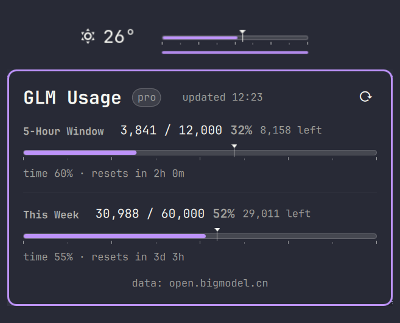

# GLM Quota — Omarchy bar plugin

Thermometer-style GLM token quota for the [Omarchy](https://omarchy.org/) bar.
The mercury fill shows how much of the **weekly** quota is spent; a floating
caret marks how far through the window's *time* you are. Click it for the
5-hour window and weekly breakdown.



- **Bar widget** — weekly usage as a thermometer gauge: fill = quota spent,
  floating caret = time through the week, ruler ticks at 0/25/50/75/100 %.
  The mercury shifts from the theme accent to orange and red as usage climbs
  past 75 % and 90 %.
- **Popup panel** — two gauges (5-hour window + this week) with used / quota /
  remaining, time progress, and reset countdowns. `r` refreshes, middle-click
  on the bar forces a refresh.
- **No natural-day concept** — every number is window-based (5 h / 7 d), as
  the BigModel quota API reports them.

中文用户：面板默认跟随系统语言显示中文，也可在配置里强制 `language: "zh"`。

## Install

```bash
omarchy plugin add https://github.com/tomasWade/omarchy-glm-quota.git --enable
```

Requires `bash`, `curl`, and `jq` (all in the Arch base repos / omarchy).

## Set up the API key

The plugin never reads keys from environment variables.

1. Create an API key in the [BigModel console](https://open.bigmodel.cn/)
   (账户 → API Keys).
2. Save it — one bare key on a single line — into `api.key` in the plugin
   folder and lock it down:

   ```bash
   echo -n "YOUR_KEY" > ~/.config/omarchy/plugins/tomasWade.glm-quota/api.key
   chmod 600 ~/.config/omarchy/plugins/tomasWade.glm-quota/api.key
   ```

   The panel shows a red hint with the exact expected path when the key is
   missing, invalid, or expired.

## Settings

Inline in `~/.config/omarchy/shell.json`, e.g.

```json
{ "id": "tomasWade.glm-quota", "refreshMinutes": 10, "language": "auto" }
```

| Setting | Default | Description |
| --- | --- | --- |
| `refreshMinutes` | `10` | How often the bar polls. The script layer caches responses for 4 minutes, so shorter intervals reuse the same numbers. Minimum 2. |
| `keyFile` | `""` | Override path for the key file. Empty uses `api.key` in the plugin folder. |
| `language` | `"auto"` | `auto` follows the system locale; `zh` / `en` force a language. |
| `demo` | `false` | Render canned numbers instead of fetching, for previewing the visuals. |

## How it works

- `bin/glm-quota` (bash + curl + jq) calls
  `open.bigmodel.cn/api/monitor/usage/quota/limit`, caches the response in
  `~/.cache/glm-quota.json` for 240 s, and always prints one valid JSON
  object — network or auth failures fall back to the cached report marked
  `stale` with a machine-readable error code (`nokey`, `unauthorized`,
  `network`, `badresp`).
- The QML side computes the time carets locally from `nextResetTime`, so
  they keep moving between polls without any requests.

## Uninstall

```bash
omarchy plugin remove tomasWade.glm-quota
rm -f ~/.cache/glm-quota.json
```

## License

[MIT](LICENSE) © tomasWade
